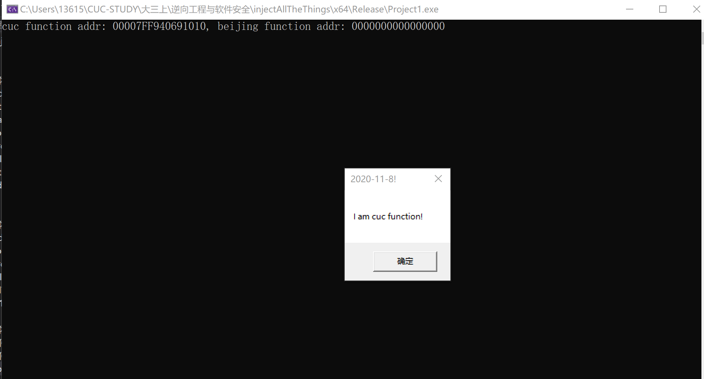
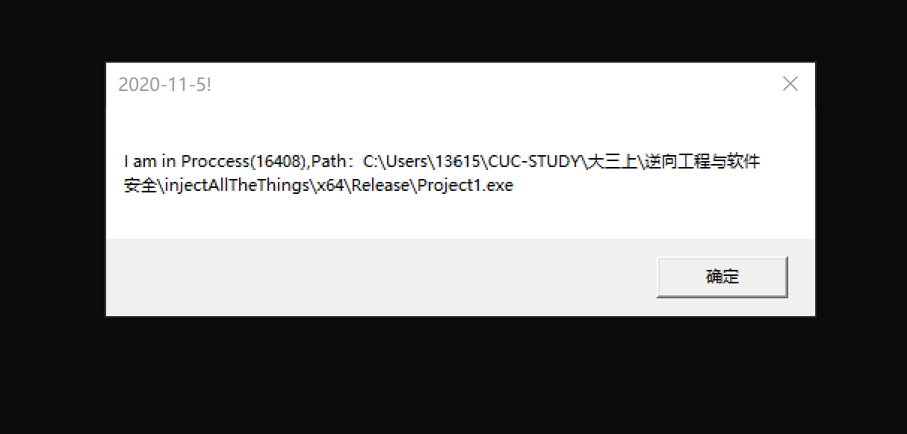
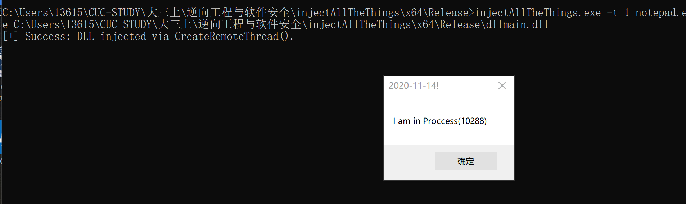

## DLL注入  
**实验要求** 
 - [x] 参考样例代码，编写一个dll文件，并能在exe中成功调用（第一步不需要实现远程线程注入）  
 - [x]  通过调用injectAllTheThings.exe方法远程注入notepad.exe   
  
**实验过程**  
1.参考样例代码，编写一个dll文件，并能在exe中成功调用（第一步不需要实现远程线程注入）   
* 编写dllpoc.cpp 并生成相应的dll 
```  
#include <windows.h>
#include <stdio.h>

BOOL APIENTRY DllMain(HMODULE hModule, DWORD  ul_reason_for_call, LPVOID lpReserved)
{
	switch (ul_reason_for_call)
	{
	case DLL_PROCESS_ATTACH:
		break;
	case DLL_PROCESS_DETACH:
		break;
	case DLL_THREAD_ATTACH:
		break;
	case DLL_THREAD_DETACH:
		break;
	}
	return TRUE;
}

//extern "C" __declspec(dllexport) int poc(int code, WPARAM wParam, LPARAM lParam) {
// __declspec(dllexport)通过导出表进行导出
extern "C" __declspec(dllexport) BOOL cuc() {


	MessageBox(NULL, L"I am cuc function!", L"2020-11-8!", 0);


	TCHAR szExePath[MAX_PATH];
	TCHAR szInfo[MAX_PATH + 100];
	GetModuleFileName(NULL, szExePath, MAX_PATH);
	wsprintf(szInfo, TEXT("I am in Proccess(%d),Path：%s"), GetCurrentProcessId(), szExePath);
	MessageBox(NULL, szInfo, L"2020-11-5!", 0);


	//return(CallNextHookEx(NULL, code, wParam, lParam));
	return TRUE;
}
//不在导出表
BOOL beijing() {
	MessageBox(NULL, L"POC called!", L"Inject All The Things!", 0);

	//return(CallNextHookEx(NULL, code, wParam, lParam));
	return TRUE;
}  
```  
* loader.c 加载上述dll  
```  
#include<Windows.h>
#include<stdio.h>
#include<stdlib.h>

typedef BOOL(*CUC_PROC_ADDR)();

int main() {
	HMODULE hmoudle = LoadLibraryA("dllpoc.dll");
	CUC_PROC_ADDR cuc_ptr = (CUC_PROC_ADDR)GetProcAddress(hmoudle, "cuc");
	void* cuc = GetProcAddress(hmoudle, "cuc");
	void* bj = GetProcAddress(hmoudle, "beijing");
	printf("cuc function addr: %p, beijing function addr: %p", cuc, bj);
	cuc_ptr();
}  
```  
* 运行loader.c  
  

注入成功，在任务管理器中验证进程号  
    

2.通过调用injectAllTheThings.exe方法远程注入notepad.exe  
因为恶意代码是不能直接用LoadLibraryA函数加载的，它的实现可以用创建远程线程注入  
* 编写dllmain.cpp,生成相应的dll  
```  
#include "stdafx.h"
BOOL APIENTRY DllMain(HMODULE hModule,
	DWORD  ul_reason_for_call,//ul,dword，无符号长整型
	LPVOID lpReserved
)
{
	switch (ul_reason_for_call)
	{
	case DLL_PROCESS_ATTACH:
		TCHAR szInfo[MAX_PATH + 100];
		wsprintf(szInfo, TEXT("I am in Proccess(%d)"), GetCurrentProcessId());
		MessageBox(NULL, szInfo, L"2020-11-14!", 0);
		//notepad进行文件保存或者打开时，实际打开的是另外的文件  
                //利用notepad的系统白名单身份
		//GetCurrentProcessId();
		break;
	case DLL_THREAD_ATTACH://dll被线程调用
		MessageBox(NULL, L"Thread attach!", L"Inject All The Things!", 0);
		break;
	case DLL_THREAD_DETACH:
		MessageBox(NULL, L"Thread detach!", L"Inject All The Things!", 0);
		break;
	case DLL_PROCESS_DETACH://dll被进程释放
		MessageBox(NULL, L"Process detach!", L"2020-11-5", 0);
		break;
	}
	return TRUE;
}    
```
因为dll被加载的时候,dllmain函数会自动被调用，所以可以把dllmain函数中的代码换成想要执行的恶意代码然后注入  
* 通过injectAllTheThings.exe实现注入  ,在命令行工具里执行  
    ```
    injectAllTheThings.exe -t 1 notepad.exe dll的绝对路径  
    ```    

成功注入  


**参考资料**  
[injectAllTheThings](https://github.com/fdiskyou/injectAllTheThings)


