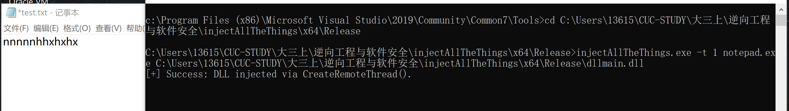
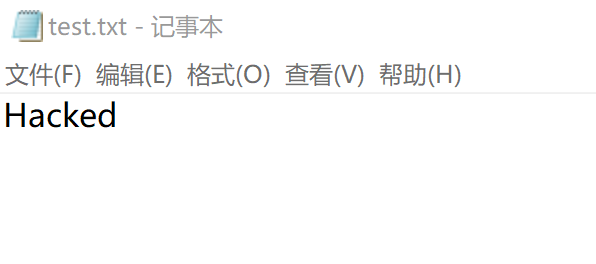

## 逆向工程与软件安全期末作业  

### 实验要求
选任意一款软件，基于以下两种技术进行软件行为的篡改
* 基于windebug进行
* 基于dll注入，IATHook进行  

本实验对notepad进行保存内容的篡改    
### 基于windebug进行篡改  
* 写入字符串保存后用windebug打开notepa.exe 
原记事本内容：AB 
```  
# 查看所有堆
!heap -a

# 查找字符串
s -u 1e43cac0000 L000ff000 "AB"

# 显示Unicode
du 000001e4`3cb23df0  

# 修改字符串
ezu 000001e4`3cb23df0 "AA"  

# 运行程序
g
```  

篡改结果  

### 基于dll注入与TATHook篡改
* **实验原理**
    * IAT Hook的原理是通过替换IAT表中原始函数地址实现Hook，其中的IAT就是导入表，结构如下：  
  
**进行Hook的步骤如下：**
1.编写DLL，注入到你想HOOK的程序中。
2.编写DLL,DLL里面获取你HOOK程序的 ImageBase以及各种头(DOS,NT,FILE,OPT)。
3.DLL 里面通过OPT的数据目录第一项.得到导入表RVA.加上ImageBase定位到导入表。
4.循环遍历导入表.导入表是一行04个字节.最后一项为0。
5.通过导入表找到IAT表.继续遍历IAT表。
6.判断IAT中的函数地址,是否是你要进行HOOK的函数地址。
是: 则进行替换函数地址.比如替换为你的.一定要注入调用约定。
不是: 继续循环。
在IAT表中没找到.说明没在这个导入表中.导入表+1(一个导入表结构大小)
继续循环 4 5 6步。  
    * **DLL注入**  
    简单概括就是dll在被加载的时候会运行dllmain函数，这时可以把想要运行的代码放入这个函数之中，在注入时得到执行。  
### 实验步骤  
目标效果是在用户使用notepad保存文字时，将文字自动改为  hacked，可知应该篡改WriteFile函数。
* 首先，构造一个FakeWriteFile函数  
```  
BOOL __stdcall FakeWriteFile(
	HANDLE       hFile,
	LPCVOID      lpBuffer,
	DWORD        nNumberOfBytesToWrite,
	LPDWORD      lpNumberOfBytesWritten,
	LPOVERLAPPED lpOverlapped
)
{
	LPFN_WriteFile fnOrigin = (LPFN_WriteFile)GetIATHookOrign(g_hHook_WriteFile); //保存原来的WriteFile函数

	char DataBuffer[] = "Hacked";
	DWORD dwBytesToWrite = (DWORD)strlen(DataBuffer);
	DWORD dwBytesWritten = 0;

	return fnOrigin(hFile, DataBuffer, dwBytesToWrite, &dwBytesWritten, lpOverlapped);
}  
```  
此函数原型与WriteFile函数一样
插播一个WriteFile函数：
> Writes data to the specified file or input/output (I/O) device
>
> ---
>
> **Requirements**
>
> | **Target Platform** | Windows                       |
> | ------------------- | ----------------------------- |
> | **Header**          | fileapi.h (include Windows.h) |
> | **Library**         | Kernel32.lib                  |
> | **DLL**             | Kernel32.dll                  |

```c
BOOL WriteFile(
  HANDLE       hFile,             // 文件句柄
  LPCVOID      lpBuffer,           // 要写入的数据
  DWORD        nNumberOfBytesToWrite,  // 要写入的字节数
  LPDWORD      lpNumberOfBytesWritten,  // 实际写入的字节数
  LPOVERLAPPED lpOverlapped					// OVERLAPPED 结构，一般设定为 NULL
);
```  
* IAT hook
参照[iathook](https://github.com/tinysec/iathook),直接运行的效果是：
  
原函数里构造的假的messageBoxA被成功调用  
* 构建dllmain  
```  
BOOL WINAPI DllMain(HINSTANCE hinstDll, DWORD dwReason, LPVOID lpvRevered) {
	switch (dwReason) {
	case DLL_PROCESS_ATTACH:
		
		MessageBox(NULL, L"Process attach!", L"Inject All The Things!", 0);
		IATHook(
			GetModuleHandle(NULL),
			"kernel32.dll",
			"WriteFile",
			FakeWriteFile,
			&g_hHook_WriteFile
		);
		break;
	case DLL_PROCESS_DETACH:
		MessageBox(NULL, L"Process detach!", L"Inject All The Things!", 0);
		UnIATHook(g_hHook_WriteFile);
		break;
	}
	return TRUE;
}  
```    
* 使用之前课上讲过的injectAllTheThings.exe把生成的dll注入到notepad.exe进程  

注入成功  
  

保存文件后打开,文件已经被成功篡改  
    
注：附上dllmain.c,injectAllTheThings是直接用的github上的源代码，就不单独附上。
参考资料：  
[IAT Hook](https://www.cnblogs.com/iBinary/p/10975839.html)  
[HOOK钩子技术3 IATHook](http://www.voidcn.com/article/p-rowolljr-ye.html)  
[windbg篡改notepad内容](https://blog.csdn.net/lixiangminghate/article/details/53086667)
[C/C++ 文件操作之CreateFile函数、ReadFile函数和WriteFile函数的用法](https://www.365jz.com/article/24618)


